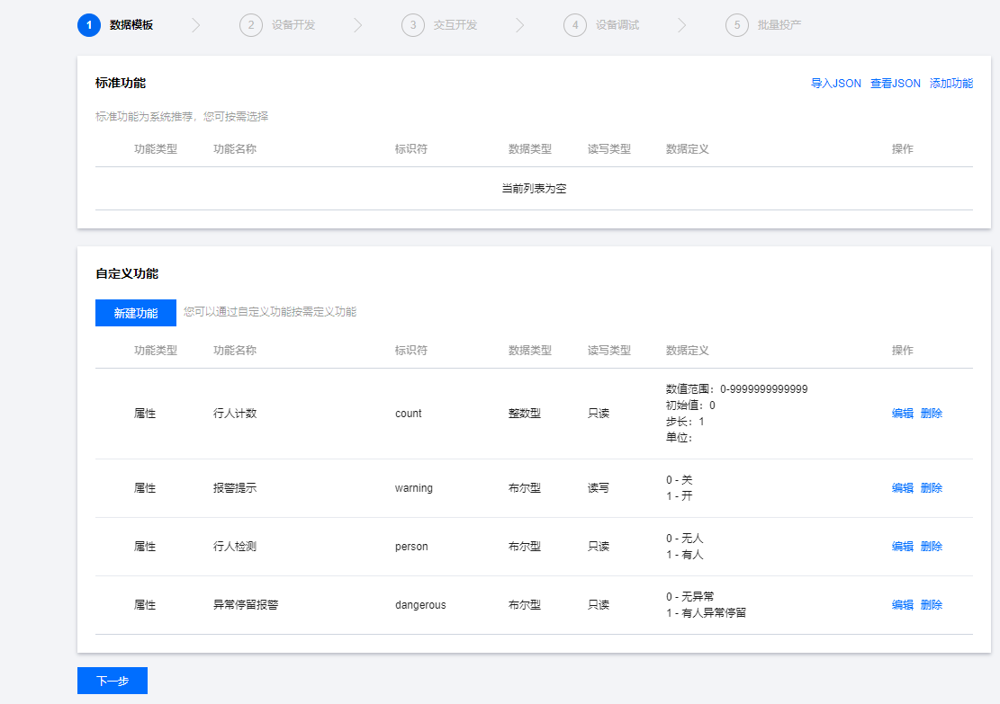

# 一、概述

随着边缘计算和深度学习领域的不断发展，越来越多的边缘计算设备开始出现在我们的视野中。我们本次提出的这一作品着眼于边缘计算与深度学习场景，提出了一款应用于无人值守的仓储、居民社区或危险禁入区域的智能监控方案，具有成本低、功耗低等优势，并可以大量分布式投放且可以基于具体场景需求修改模型功能，此处我们以人像检测为例，对于长时间徘徊于某区域的行人进行智能识别，并且将异常现象及时上报至云端，从而实现边缘AI与tencentos-tiny完美结合的智能安防案例。

# **二、系统的创新点：**

**1.本系统采用了Tencent OS-tiny这一物联网实时操作系统来实现片上资源的智能化管理。** 一方面灵活高效的管理了系统的片上资源，为系统并发的执行多个任务提供了基础；另一方面，搭载TencentOS-tiny的端侧系统可以方便的与腾讯云对接，依托于腾讯云服务器上的丰富资源为端云结合带来了更多的可能性。

**2.本系统搭载了Tensorflow Lite Micro的超低功耗深度学习AI推理框架。** Tensorflow Lite Micro是tensorflow框架针对微控制器应用场景所专门设计的深度学习推理框架，它占用的资源少，运行时内存最低只需要16KB，同时其兼容tensorflow框架，依托于Tensorflow平台强大的生态背景，使得更多开发者可以方便的集成、使用AI算法，为端侧带来人工智能的新活力。

_**目前由我们团队制作的**_[_**Tensorflow Lite Micro组件**_](https://github.com/Tencent/TencentOS-tiny/tree/master/components/ai/tflite_micro)_**已经进入Tencent OS-tiny主仓库，其中提供的了Tensorflow Lite Micro的全部源码以及针对ARM Cortex M系列的MDK lib库文件，可以方便的集成到MCU开发环境中。**

**3.本系统将边缘AI和tencentos-tiny结合在一起，面向区域安防管理，提出了一种新的端云系统架构**。通过对这种机制的验证并且配合详细的用户移植文档，让整个系统具备在多领域多场景的可迁移性与易用性。

系统拓扑结构图：


单个Tencent OS-tiny内部结构图：


整体系统流程图：


整体系统的工作流程可以概述为以下内容：首先基于Tencent OS-tiny实现了一个超低功耗的机器视觉应用——基于深度学习算法以及Tensorflow Lite Micro 端侧神经网络推理框架的小区域人形检测，根据我们实际的测试，行人检测的正确率达到84%，且可以在MCU端上运行；在MCU端检测到有人之后，MCU端将有关行人的数据上传到云端，云端根据收到的数据来唤醒相关的高性能设备，进一步获取行人的真实数据。

相比与传统的社区管理员通过大量连接了高清摄像头的屏幕来完成的社区的安全管理的方法相比，我们这种基于Tencent OS-tiny实现的超低功耗机器视觉与端云协同的智能安防系统只会在端侧检测到有人之后才会将视频流接入管理员的屏幕，不仅减轻了管理员的工作负担，而且更重要的是端侧实现的智能化应用将极大的节省了系统的带宽资源，在提升系统响应的同时也降低了成本，可以称的上是一种比较好的解决方案。

演示视频：

> 

# 三、系统移植概述：

我们的工作是已于近期开源至官方主仓库，而且开发者可以按照指南进行复现。

#### **1. 准备目标硬件（开发板/传感器/模组）**

需要准备如下硬件:

- 开发板：NUCLEO-L496ZG，MCU为STM32L496ZG；
- Camera：获取RGB图像，本例程使用OV2640摄像头；
- 通信模组：负责MCU与云端之间的通信，本例程选用的乐鑫esp8266

## **2.准备系统软件**

- 首先，参考TencentOS tiny基于keil的移植教程进行移植： [https://github.com/Tencent/TencentOS-tiny/blob/master/doc/10.Porting\_Manual\_for\_KEIL.md](https://github.com/Tencent/TencentOS-tiny/blob/master/doc/10.Porting_Manual_for_KEIL.md)。为了方便初始化MCU的外设，后续要继续使用STM32CubeMX软件，请确保安装了该软件；注：在系统移植成功后，工程可以进行线程任务切换，通过串口打印"hello world"，基础keil工程代码准备完毕。
- 准备Tensorflow Lite Micro组件。在主仓库中的 `TencentOS-tiny\components\ai\tflite_micro` 路径下，本次我们主要是要使用Tensorflow Lite Micro推理框架来实现行人检测任务，所以可以直接采用对应内核的lib库文件的方式来将其集成到系统中，在实际应用的过程中只需要编写调用有关的API即可以实现AI算法在MCU平台上的部署。

## **3.系统移植流程**：

在获得基础工程之后，我们首先开始移植驱动代码，

- 添加与本例程相关的[Necluo STM32L496RG的摄像头驱动代码](https://github.com/Tencent/TencentOS-tiny/tree/master/board/NUCLEO_STM32L496ZG/BSP/Hardware/Src)(此处使用的是我们提交到官方仓库中的驱动代码），
- 在mcu\_init函数重写DCMI帧中断回调函数，
    - 值得注意的是，代码需要写在CubeMx生成的注释语句内，当使用CubeMX重新配置外设并生成代码时，所添加的代码才不会被覆盖掉，如下所示，代码添加在/\* USER CODE BEGIN 4 _/ 和 /_ USER CODE END 4 \*/注释语句之间：

```
/* USER CODE BEGIN 4 */
void HAL_DCMI_FrameEventCallback(DCMI_HandleTypeDef *hdcmi)
{
    if(hdcmi->State == 2 && frame_flag != 1){
        frame_flag = 1; 
    }
}
/* USER CODE END 4 */
```

同时添加LCD程序显示摄像头图像，

```
void task1(void *arg)
{
    while (1) {
      if(frame_flag == 1){
                
                if(HAL_DCMI_Stop(&hdcmi))Error_Handler(); //stop DCMI
                LCD_2IN4_Display(camera_buffer,OV2640_PIXEL_WIDTH,OV2640_PIXEL_HEIGHT);
                //display
                frame_flag = 0;
                if(HAL_DCMI_Start_DMA(&hdcmi,DCMI_MODE_CONTINUOUS,\   //restart DCMI
                                     (uint32_t)camera_buffer ,\
                                     (OV2640_PIXEL_WIDTH*OV2640_PIXEL_HEIGHT)/2))
                    Error_Handler(); 
                osDelay(50);
    }
}
```

- 然后将Tensorflow Lite Micro的[模型和数据接入部分代码](https://github.com/Tencent/TencentOS-tiny/tree/master/examples/tflitemicro_person_detection)全部添加到工程中，同时将
    - `TencentOS-tiny\components\ai\tflite_micro\KEIL\retarget.c`
    - `TencentOS-tiny\components\ai\tflite_micro\ARM_CortexM4_lib\tensorflow_lite_micro.lib`

添加到工程中，最后，我们关闭Keil的Microlib库，添加有关的include目录


注：最下方的路径为：

```
TencentOS-tiny\components\ai\tflite_micro\ARM_CortexM4_lib\tensorflow\lite\micro\tools\make\downloads
```

- 调整优化等级和tflite\_micro的交互信息输出串口：


其中宏`NUCLEO_STM32L496ZG`是指定Nucleo STM32L496的hlpuart1为系统printf函数的输出串口，具体定义在Nucleo STM32L496的BSP文件夹中的`mcu_init.c`中。

至此Tensorflow Lite Micro已经成功的移植到MCU平台中，可以开始设计与行人检测有关的应用层代码了。

- 设计图像预处理函数。在本例程中，模型要求输入神经网络的图像为灰度图，为完成摄像头获取的RGB彩图到模型输入需要的灰度图转换，需从输入的RGB565像素格式中解析出R、G、B三通道的值，再根据心理学公式计算出单个像素点的灰度，具体代码如下：

```
uint8_t rgb565_to_gray(uint16_t bg_color)
{
    uint8_t bg_r = 0;
    uint8_t bg_g = 0;
    uint8_t bg_b = 0;
    bg_r = ((bg_color>>11)&0xff)<<3;
    bg_g = ((bg_color>>5)&0x3f)<<2;
    bg_b = (bg_color&0x1f)<<2;
    uint8_t gray = (bg_r*299 + bg_g*587 + bg_b*114 + 500) / 1000;
    return gray;
}

void input_convert(uint16_t* camera_buffer , uint8_t* model_buffer)
{
    for(int i=0 ; i<OV2640_PIXEL_WIDTH*OV2640_PIXEL_HEIGHT ; i++)
    {
        model_buffer[i] = rgb565_to_gray(camera_buffer[i]);
    }
}
```

- 编写行人检测线程任务函数：

```
void task1(void *arg)
{
    while (1) 
    {
      if(frame_flag == 1)
      {
      	if(HAL_DCMI_Stop(&hdcmi))
			Error_Handler(); //stop DCMI
		frame++;
		input_convert(camera_buffer,model_buffer);
		res_p = person_detect(model_buffer);
		LCD_2IN4_Display(camera_buffer,OV2640_PIXEL_WIDTH,OV2640_PIXEL_HEIGHT);
		if(res_p == 1)
		{
			HAL_GPIO_WritePin(GPIOB, LCD_DC_Pin|LED_Pin, GPIO_PIN_SET);
			if(count == 0)
				frame = 0;
			if(frame-count > 5)
				count = 0;
			else
			{
					count ++;
			}
			if(count == 5)
			{
				person_flag = 1;	
				count = 0;
				printf("detect a dangerous person!!\n");
			}
		}
		else
		{
			HAL_GPIO_WritePin(GPIOB, LCD_DC_Pin|LED_Pin, GPIO_PIN_RESET);
		}
		frame_flag = 0;
		person_flag = 0;
		if(HAL_DCMI_Start_DMA(&hdcmi,DCMI_MODE_CONTINUOUS,(uint32_t)camera_buffer ,\
			(OV2640_PIXEL_WIDTH*OV2640_PIXEL_HEIGHT)/2))
			Error_Handler(); //restart DCMI
		}
		osDelay(50);
    }
}

void task2(void *arg)
{
    while (1) 
    {
        printf("***task2\r\n");
        osDelay(50);
    }
}
```

本主体应用程序实现若在10帧中检测到超过半数的人像，就会判定为异常现象并上报，同时根据我们实际的测试结果，执行一帧图像推理，耗时约633 ms。

- 在MCU端本地处理完行人检测之后，MCU与云端之间的数据传输部分代码具体如下：

```
int deal_up_stream_user_logic(DeviceProperty *pReportDataList[], int *pCount)
{
    int i, j;
		static  int person_count_last, person_flag_last, dagerous_flag_last = 0;
		
	//上传数据逻辑处理
		if(person_count != person_count_last || person_flag != person_flag_last){
			
			sg_DataTemplate[0].state = eCHANGED;
			sg_DataTemplate[3].state = eCHANGED;
			
			sg_ProductData.m_count = person_count;
			sg_ProductData.m_person = person_flag;
			
			person_count_last = person_count;  
			person_flag_last = person_flag;
			
		}


		if(dagerous_flag != dagerous_flag_last)
		{
			sg_DataTemplate[1].state = eCHANGED;
			sg_ProductData.m_dagerous = dagerous_flag;
			dagerous_flag_last = dagerous_flag;
		}
    
		
    for (i = 0, j = 0; i < TOTAL_PROPERTY_COUNT; i++) {
        if(eCHANGED == sg_DataTemplate[i].state) {
            pReportDataList[j++] = &(sg_DataTemplate[i].data_property);
						sg_DataTemplate[i].state = eNOCHANGE;
        }
    }
    *pCount = j;

    return (*pCount > 0)?QCLOUD_RET_SUCCESS:QCLOUD_ERR_FAILURE;
}
void deal_down_stream_user_logic(void *client, ProductDataDefine   * pData)
{
		//处理下发逻辑
    if (sg_ProductData.m_warning == 1) {
			/* 开警示 */
			HAL_GPIO_WritePin(GPIOB, LED_Pin, GPIO_PIN_SET);
    } else {
			/* 关警示 */
			HAL_GPIO_WritePin(GPIOB, LED_Pin, GPIO_PIN_RESET);
    }
}
```

- 腾讯物联网开发平台-腾讯连连小程序开发

为了方便用户实时地查看设备端上传的信息（是否有异常报警、人流量计数等），以及控制设备端发出报警提示，我们利用腾讯云IoT Explorer提的供开发平台，开发腾讯连连小程序。

开发过程如下，登录腾讯云开发平台：

步骤一：新建产品


步骤二：跟据场景和应用定义数据模板

设备端上传的只读数据：

- **行人检测** ：设备端检测到行人时，标志位置为1；
- **异常停留报警** ：当设备端持续检测到行人时，触发异常停留报警，标志位置为1；
- **行人计数** ：当设备端的行人检测结果从无人变化到有人时，人流量计数值+1

设备端接收的控制指令：

- **报警提示** ：当用户看到有异常停留，可以控制设备端发出报警提示，也可以关闭报警提示。



步骤三：编辑小程序的面板

由于目前腾讯连连提供的模板较少，暂时使用按钮显示设备状态信息。


步骤四：设备调试

- 将产品ID、密钥、设备号信息填入设备端的程序；
- 基于腾讯TOS的AT组件和ESP8266适配的SAL框架，移植程序；
- 设备端编写上行和下行数据处理逻辑。


# 四、结语

在本次作品中，我们主要提出了一种基于边缘AI+tencentos-tiny的新架构，虽然在用户前端的包装还有许多可以改进的空间，但是通过对这种机制的验证并且配合详细的用户移植文档，使我们这个作品具备了更多的可迁移性，同时也打开了Tencent OS-tiny对于人工智能领域的支持，在未来我们会继续完善Tensorflow Lite Micro组件并不断更新新的应用，致力于丰富整个Tencent OS-tiny的生态。