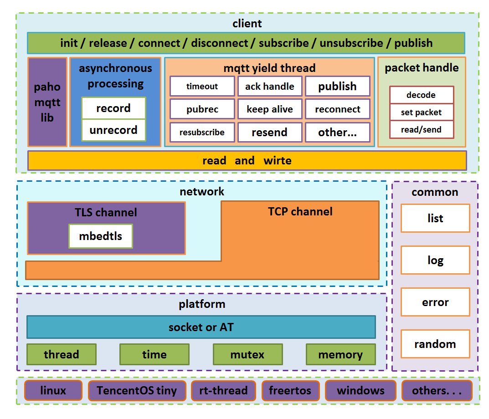

[](https://github.com/jiejieTop/mqttclient/releases)

[](https://github.com/jiejieTop/mqttclient/blob/master/LICENSE)


[English Documents](README.md)

# mqttclient

**一个高性能、高稳定性的跨平台MQTT客户端**

一个高性能、高稳定性的跨平台MQTT客户端，基于socket API之上开发，可以在嵌入式设备（FreeRTOS/LiteOS/RT-Thread/TencentOS tiny）、Linux、Windows、Mac上使用，拥有非常简洁的API接口，以极少的资源实现QOS2的服务质量，并且无缝衔接了mbedtls加密库。

## 优势：

- **具有极高的稳定性**：无论是**掉线重连**，**丢包重发**，都是**严格遵循MQTT协议标准**执行，除此之外对**大数据量**的测试无论是收是发，都是非常稳定，**高频**测试也是非常稳定。

- **轻量级**：整个代码工程极其简单，不使用mbedtls情况下，占用资源极少，作者曾使用esp8266模组与云端通信，整个工程代码消耗的RAM不足15k。

- **支持mbedtls加密传输**，让网络传输更加安全，而且接口层完全不需要用户理会，无论是否加密，mqttclient对用户提供的API接口是**固定**的，这就很好的兼容了一套代应用层的码可以加密传输也可以不加密传输。

- **支持多客户端**，同时兼容多个客户端运行工作，一个设备连接多个的服务器。

- **支持同步异步处理**，应用程序无需阻塞等待浪费CPU资源。

- **支持拦截器配置**，在某些平台中，客户端会默认自动订阅系统主题，而且每次来自服务器的主题都是变动的，此时需要使用拦截器进行拦截，分离主题与数据信息，并递交给用户，极大提高灵活性。

- **拥有在线代码生成工具**，极其简单配置就可以生成对应的代码，地址：[https://jiejietop.gitee.io/mqtt/index.html](https://jiejietop.gitee.io/mqtt/index.html)

- **拥有极简的API接口**，总的来说，mqttclient的配置都有默认值，基本无需配置都能使用的，也可以随意配置，对配置都有健壮性检测，这样子设计的API接口也是非常简单。

- **多功能参数可配置可裁剪**，重连时间间隔、心跳周期、最大订阅数量、命令超时、读写缓冲区大小、拦截器处理等等参数功能可裁剪可配置，满足开发者再复杂、简单等各种开发环境下的使用需求。

- **支持自动重新订阅主题**，在自动重连后保证主题不会丢失。

- **支持主题通配符`“#”、“+”`**。

- **订阅的主题与消息处理完全分离**，让编程逻辑更加简单易用，用户无需理会错综复杂的逻辑关系。

- **mqttclient内部已实现保活处理机制**，无需用户过多关心理会，用户只需专心处理应用功能即可。

- **拥有非常好的设计**，以极少的资源设计了**记录机制**，当报文在丢失的时候进行重发操作，确保qos1、qos2服务质量等级的报文保证其服务质量。

- **有非常好的代码风格与思想**：整个代码采用分层式设计，代码实现采用异步处理的思想，降低耦合，提高性能。

- **基于标准BSD socket之上开发**，只要是兼容BSD socket的系统均可使用。

- **无缝衔接salof**：它是一个同步异步日志输出框架，在空闲时候输出对应的日志信息，也可以将信息写入flash中保存，方便调试。

- **使用著名的 paho mqtt 库封包**。

- **无其他依赖**。

## 在线代码生成工具

本项目拥有代码生成工具，只需要在线配置即可生成代码，极其简单易用，代码生成工具地址：[https://jiejietop.gitee.io/mqtt/index.html](https://jiejietop.gitee.io/mqtt/index.html)


## 占用资源大小

总计占 **10857字节** 的ROM，而RAM的开销则几乎只依赖动态内存，在不使用TLS加密传输的情况下，维持QOS0服务质量等级的通信动态内存大约仅需要**3694**字节，这包括1024读缓冲区 + 1024写缓冲区 + 1024内部线程栈大小，相对于其他MQTT客户端来说，mqttclient需要的RAM资源开销极少。

| Code | RO Data | RW Data | ZI Data | Object Name |
| -- | -- | -- | -- | -- |
| 7118 | 791 | 0 | 0 | mqttclient.o |
| 546 | 0 | 0 | 0 | mqttconnectclient.o |
| 212 | 0 | 0 | 0 | mqttdeserializepublish.o |
| 476 | 0 | 4 | 0 | mqttpacket.o |
| 236 | 0 | 0 | 0 | mqttserializepublish.o |
| 310 | 0 | 0 | 0 | mqttsubscribeclient.o |
| 38 | 0 | 0 | 0 | mqttunsubscribeclient.o |
| 56 | 0 | 0 | 0 | nettype_tcp.o |
| 62 | 0 | 0 | 0 | network.o |
| 24 | 0 | 0 | 0 | platform_memory.o |
| 40 | 0 | 0 | 0 | platform_mutex.o |
| 344 | 0 | 0 | 0 | platform_net_socket.o |
| 94 | 0 | 0 | 0 | platform_thread.o |
| 70 | 0 | 0 | 0 | platform_timer.o |
| 246 | 0 | 4 | 0 | random.o |
| 62 | 0 | 0 | 0 | mqtt_list.o |
| - | - | - | - | - |
| 10066  | 791 | 8 | 0 | total |

## 整体框架

拥有非常明确的分层框架。



- 在框架的最上方是**API**函数接口，实现了客户端的**申请、释放、设置参数、连接服务器、断开连接、订阅主题、取消订阅主题、发布消息**等函数接口。

- 使用了著名的**paho mqtt**库作为MQTT报文封包库。

- 采用异步处理的机制去管理所有的ack，它在发送报文的时候不用等待服务器的应答，只是记录下来，在收到服务器的ack后，取消这个记录，**效率极高**；而在发送mqtt报文（QoS1/QoS2）的时候没有收到服务器的应答时，将**重发**该报文。

- 内部实现了一个**mqtt yield**线程，统一处理所有的内容，比如**超时的处理、ack报文的处理、收到来自服务器的publish报文**，此时会去调用回调函数告知用户收到的数据，**发布释放、发布完成报文的处理、心跳报文（保持活性），当与服务器断开连接时需要尝试重连、重新订阅主题，重新发送报文或者应答**等。

- 报文的处理，如**读写报文、解码mqtt报文、设置报文（dup标记）、销毁报文**等操作。

- **network**是网络组件，它可以**自动选择数据通道**，如果是加密方式则通过**tls加密**进行数据传输，而tls可以选择mbedtls作为加密后端；也可以是**tcp直连**方式，最终都是通过tcp传输的。

- **platform**是平台抽象层，封装了不同系统的东西，比如**socke或者AT，线程、时间、互斥锁、内存管理**，这些是与系统打交道的，也是跨平台必要的封装。

- 最右边的则是通用的内容，**list的处理、日志库、错误处理、软件随机数发生器**等。

## 支持的平台

**目前已实现了Linux、TencentOS tiny、FreeRTOS、RT-Thread平台（已做成软件包，名字为`kawaii-mqtt`），除此之外TencentOS tiny的AT框架亦可以使用，并且稳定性极好！**

| 平台           | 代码位置 |
| -------------- | -------- |
| Linux          | [https://github.com/jiejieTop/mqttclient](https://github.com/jiejieTop/mqttclient) |
| TencentOS tiny | [https://github.com/Tencent/TencentOS-tiny/tree/master/board/Fire_STM32F429](https://github.com/Tencent/TencentOS-tiny/tree/master/board/Fire_STM32F429) |
| TencentOS tiny AT 框架 | [https://github.com/jiejieTop/gokit3-board-mqttclient](https://github.com/jiejieTop/gokit3-board-mqttclient) |
| RT-Thread      | [https://github.com/jiejieTop/kawaii-mqtt](https://github.com/jiejieTop/kawaii-mqtt) |
| FreeRTOS       | [https://github.com/jiejieTop/freertos-mqttclient](https://github.com/jiejieTop/freertos-mqttclient) |


## 版本

| 发布版本 | 描述 | 
| --- | --- |
| [v1.0.0] | 初次发布，完成基本框架及其稳定性验证 |
| [v1.0.1] | 修复主动与服务器断开连接时的逻辑处理 |
| [v1.0.2] | 添加新特性——拦截器，修复一些小bug |
| [v1.0.3] | 避免造成全局污染修改了log、list相关函数的命名 |
| [v1.0.4] | 重新调整了network结构与mbedtls数据通道 |
| [v1.1.0] | 一个较大版本的更新，重构部分代码，优化MQTT处理的逻辑，提升整体的稳定性，支持多客户端，支持设置遗嘱，优化API接口，增加多个云平台的测试代码与说明文档，增加在线代码生成工具、在线裁剪配置工具 |

## 问题

欢迎以 [GitHub Issues](https://github.com/jiejieTop/mqttclient/issues) 的形式提交问题和bug报告

## 版权和许可

mqttclient 遵循 [Apache License v2.0](https://github.com/jiejieTop/mqttclient/blob/master/LICENSE) 开源协议。鼓励代码共享和尊重原作者的著作权，可以自由的使用、修改源代码，也可以将修改后的代码作为开源或闭源软件发布。

## linux平台下测试使用

### 安装cmake：

```bash
    sudo apt-get install cmake g++
```

### 测试程序

| 测试平台 | 位置 |
| -- | -- |
| emqx（我私人部署的服务器） | [./test/emqx/test.c](./test/emqx/test.c) |
| 百度天工 | [./test/baidu/test.c](./test/baidu/test.c) |
| onenet | [./test/onenet/test.c](./test/onenet/test.c) |
| 阿里云物联 | [./test/ali/test.c](./test/ali/test.c) |

### 编译 & 运行

```bash
    ./build.sh
```

运行**build.sh**脚本后会在 **./build/bin/**目录下生成可执行文件**emqx**、**baidu**、**onenet**等多个平台的可执行程序，直接运行即可。

```bash
    ./build/bin/emqx 
```

### 编译成动态库libmqttclient.so

```bash
    ./make-libmqttclient.sh
```

运行`make-libmqttclient.sh`脚本后会在 `./libmqttclient/lib`目录下生成一个动态库文件`libmqttclient.so`，并安装到系统的`/usr/lib `目录下，相关头文件已经拷贝到`./libmqttclient/include`目录下,将其拷贝到你的工程中即可，编译应用程序的时候只需要链接动态库即可`-lmqttclient -lpthread`，动态库的配置文件是根据`./test/mqtt_config.h`配置的。

如果你是用交叉编译器的话，则应该根据你使用的编译器导出对应的环境变量（此处使用的交叉编译器是arm-linux-gnueabihf-gcc），同时你也必须将动态库文件`libmqttclient.so`拷贝到你的嵌入式系统的`/usr/lib `目录下：

```bash
    export CROSS_COMPILE=arm-linux-gnueabihf- 
```

如若需要卸载**libmqttclient.so**，执行以下命令即可：

```bash
    ./make-libmqttclient.sh remove
```

## 学习更多

请看文档：

- [MQTT协议简介](./docs/mqtt-introduction.md)

- [MQTT协议通信过程](./docs/mqtt-communication.md)

- [mqttclient代码生成工具](./docs/mqtt-tool.md)

- [mqttclient配置及裁剪工具](./docs/mqtt-config.md)

- [mqttclient设计与实现方式](./docs/mqtt-design.md)

- [mqttclient连接到百度天工物接入](./docs/mqtt-baidu.md)

- [mqttclient连接到OneNET云平台](./docs/mqtt-onenet.md)

- [mqttclient连接到阿里云物联网平台](./docs/mqtt-aliyun.md)
