# TencentOS tiny定制开发板EVB_LX快速入门指南

| Revision | Date      | Description |
| -------- | --------- | ----------- |
| 1.0      | 2020-2-12 | 文档初版    |

## 1. 定制开发板EVB_LX硬件简介

### 1.1 开发板简介

EVB_LX+是腾讯物联网操作系统TencentOS tiny 团队联合兆易创新（GD32）、南京厚德物联网有限公司三方合作设计的一款物联网评估板，用于TencentOS tiny 基础内核、RISC-V新IP核架构和IoT组件功能体验和评估。
开发板功能图如下所示：

### 1.2 开发板特性
**CPU** ：GD32VF103RBT6, 108MHz，128K Flash，32KB SRAM

**显示屏** ：OLED，64*32分辨率

**电源特性** ：Micro USB接口，5V供电，内部有5V转3.3V的DCDC，MCU供电电压为3.3V，系统IO电压也为3.3V

**按键** ：一个复位按键，一个功能按键

**外部扩展存储** ：SPI FLASH

**LED指示灯** ：上电指示 LED，红色；一个用户定义LED，蓝色

**调试接口** ：板载GD-Link下载调试器，UART2串口连接PC

**XTAL** ：8MHz，32.768KHz

**传感器扩展接口E53 Interface** ：支持E53传感器案例扩展板（支持UART、SPI、IIC、GPIO、ADC、DAC等）

**网络模块扩展接口WAN Interface** ：支持多种无线通信模组扩展（UART&SPI&GPIO）

**操作系统支持** ：TencentOS tiny

### 1.3 开发板硬件详解

#### 1.3.1 电源电路
* 电源稳压电路
外部USB输入电压一般为5V，但这并不能直接作为电源给EVB_LX供电，EVB_LX上的元器件供电电压范围普遍在1.8V-3.6V，推荐电压均为3.3V，（BC35供电范围是：3.1V-4.2V，推荐电压3.8V，使用3.3V也可以正常工作），因此需要将5V的电平转换成3.3V供给EVB_LX开发板使用，这里使用RT8059作为3.3V稳压器芯片。
RT8059是一款高效率脉冲宽度降压型DC/DC转换器。输入电压2.8V-5.5V，输出电压可调范围为：0.6V-Vin，输出电流可以达到1A。在我们提供的电路中将输出调节至3.3V，让开发板正常工作。
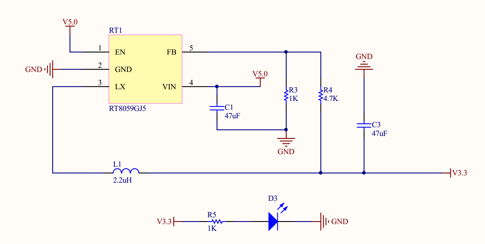

#### 1.3.2  GD32V最小系统电路
单片机最小系统或者叫最小硬件单元电路，指用最少元器件组成的单片机可以正常工作的系统。最小系统基本由电源、单片机、晶振、复位电路、程序烧录接口组成，电源使用3.3V直接供电，其他部分原理图如下：

#### 1.3.3  USB电平转换电路
USB电平转换电路是用于MCU和PC通信的场景中。PC机上的通信接口使用USB接口，相应的电平逻辑需要遵照USB电平规则，而MCU的串行通信接口是串口，相应电平需要遵循TTL原则。为了使两者可以互相通信，就需要一个电平转换器，EVB_LX上使用了CH340芯片作为转换器，CH340外围只需要接很少的元器件即可以实现USB总线转接，使用非常方便也广泛运用在USB转TTL工具上，电路如下：

#### 1.3.4  OLED显示电路
OLED液晶显示模块用来向用户显示系统状态、参数或者要输入系统的功能。为了展示良好的视觉效果，模块使用SSD1306驱动的OLED显示屏，分辨率为64*32。SSD1306芯片专为共阴极OLED面板设计，嵌入了对比控制器、显示RAM和晶振，并减少了外部器件和功耗，有256级亮度控制。
该款OLED使用IIC接口，由于IIC接口空闲时引脚要上拉，因此下面的原理图中接了10k电阻上拉，然后才接入MCU引脚。
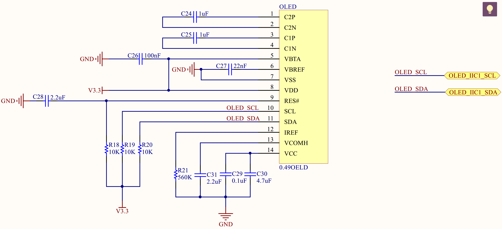

#### 1.3.5 用户按键
开发板带有一个系统Reset按键，和一个功能按键。复位按键是直接接入GD32V MCU的硬件复位Pin，按下复位按键，系统自动重启复位。功能按键可以提供给开发者做功能定义开发，都是使用GPIO口，方向为输入，低电平有效。其原理图如下图所示。
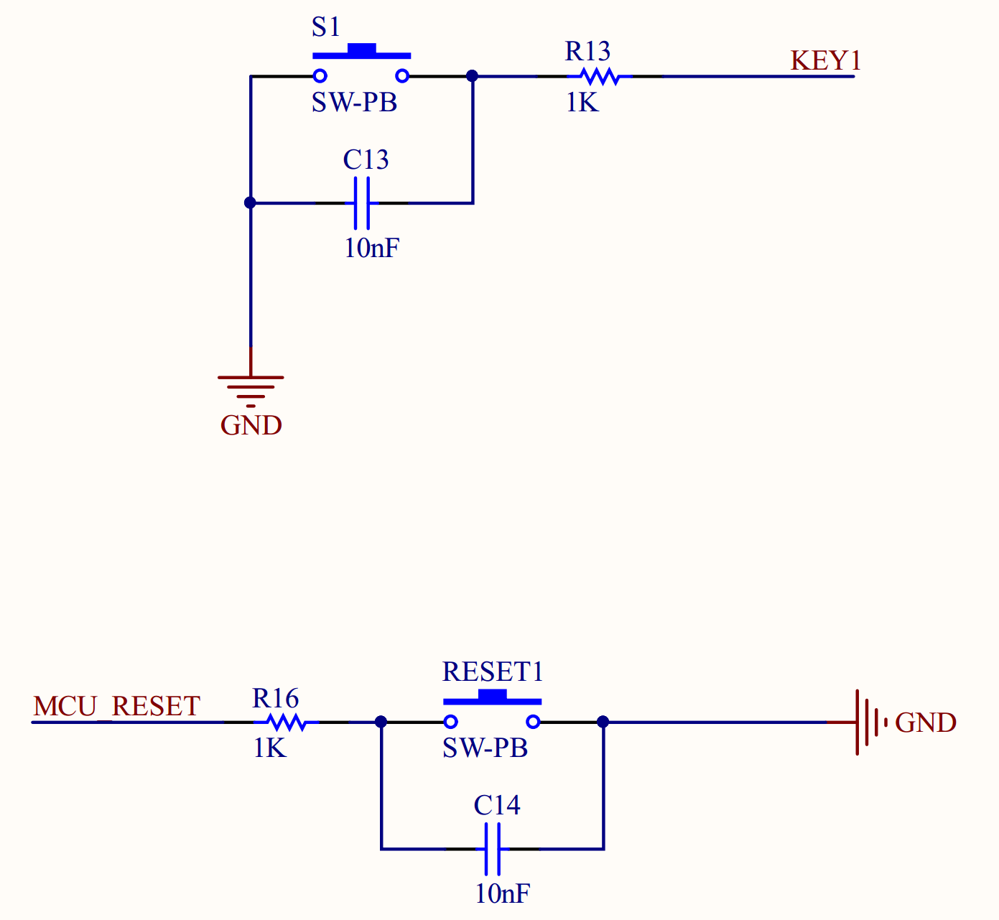

#### 1.3.6 LED程序指示灯
为了方便项目开发调试，EVB_LX开发板接出来一个LED灯，供用户自己设置状态使用，该LED灯接MCU的PB2引脚，当PB2引脚输出高电平时，会点亮LED灯。

#### 1.3.7  Flash存储电路扩展
开发板带有一个SPI Nor Flash芯片扩展，用户存储一部分用户数据和存储空间扩展，电路图如下：

#### 1.3.8  多串口切换电路
开发板带有多串口切换功能，通过拨S2 开关可以切换串口映射关系，开关切换到PC AT，可以使用PC机上的串口助手发送AT命令来调试WAN口的通信模组；当开关切换到MCU AT，是通过GD32V MCU的串口直接来发送AT指令控制通信模组，同时CH340串口连接PC可以做日志输出。串口切换电路图如下：
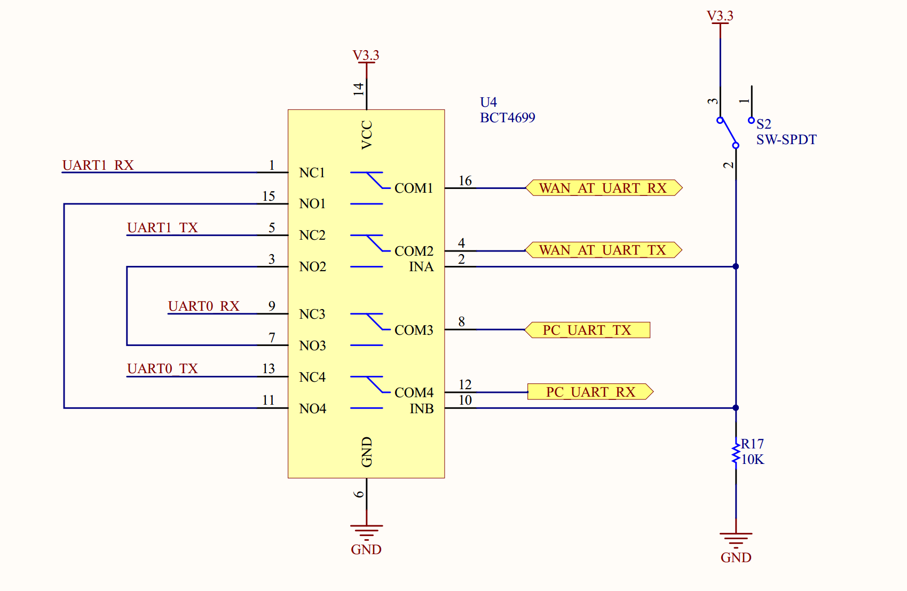

#### 1.3.9 E53 传感器扩展接口
开发板设计有E53接口的传感器扩展板接口，该接口可兼容所有E53接口的传感器扩展板，实现不同物联网案例场景的快速搭建。该接口可接入UART、SPI、I2C、ADC等通信协议的传感器，其原理图如下图所示。
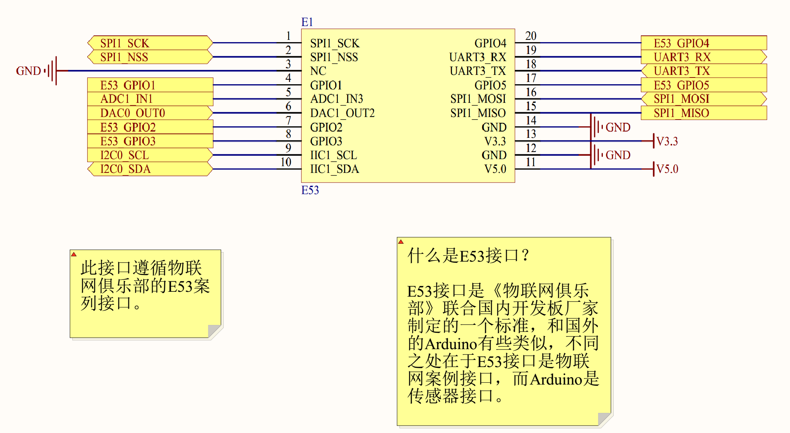

#### 1.3.10 WAN通信模块扩展接口
开发板设计有通信扩展板的扩展接口，该接口可接入WIFI、NB-IoT、2G、腾讯定制IoT模组、LoRaWAN等不同通信方式的通信扩展板，以满足不同场景上云的需求，其原理图如下图所示。
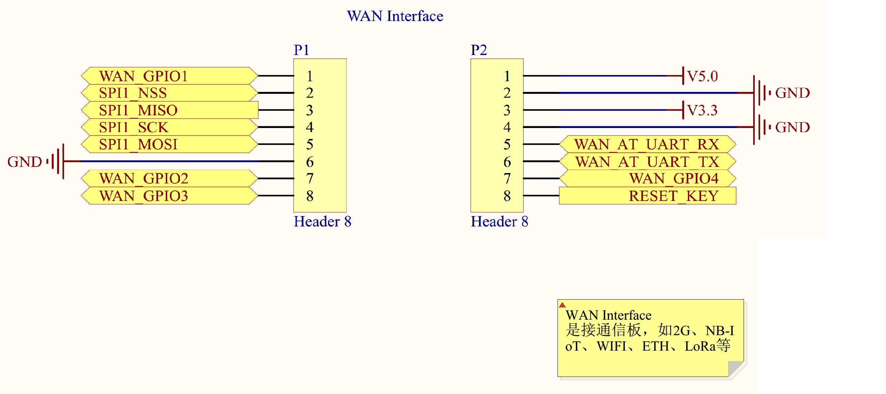

#### 1.3.11开发板部分引脚和模块映射关系
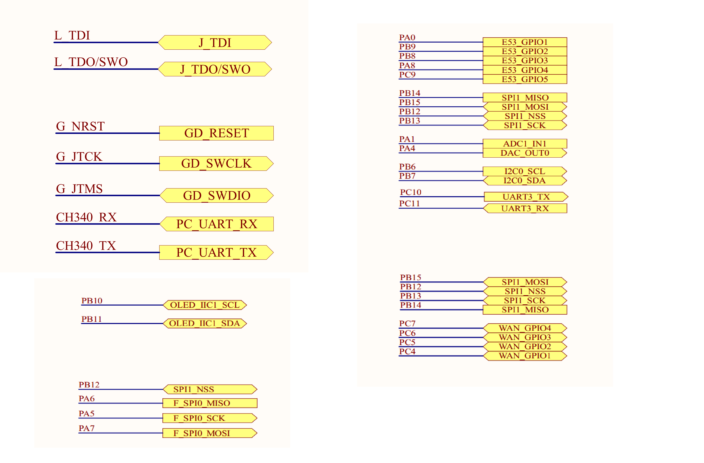

### 1.4 开发板开箱安装指南

#### 1.4.1  检查配套设备
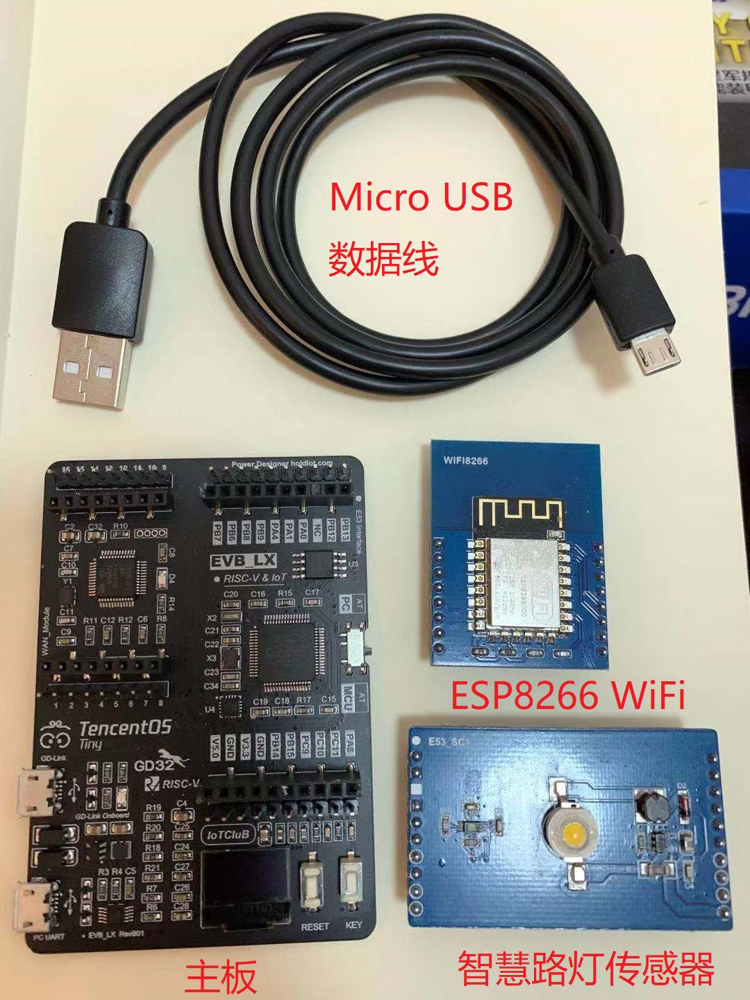
打开开发套件盒子后，开发者可以找到开发板主板，一个WAN口wifi扩展板ESP8266、和一个智慧路灯传感器扩展板E53_SC1(如需要更多传感扩展板可自行找合作供应商（物联网俱乐部）购买），如上图所示。

#### 1.4.2 安装WAN口WiFi模块
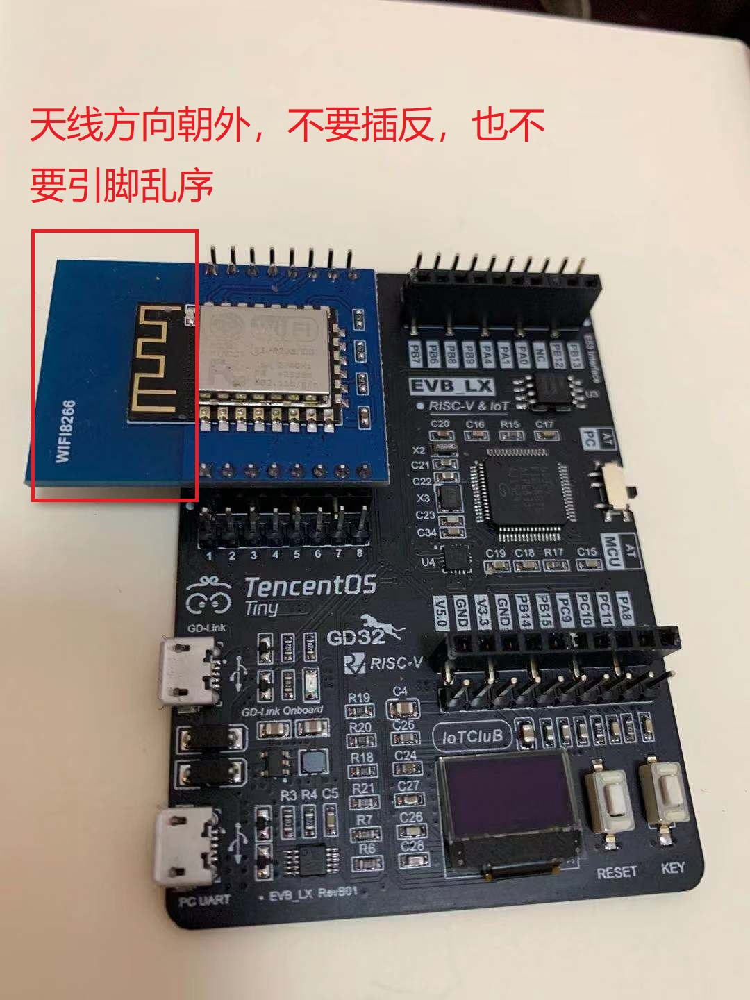

#### 1.4.3 安装传感器扩展板
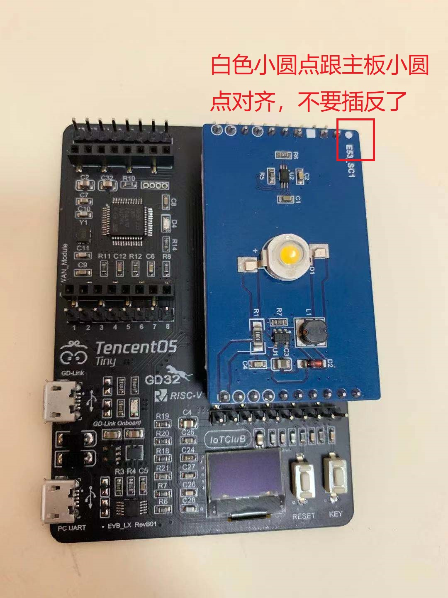
根据您开发套件配套的传感扩展板安装其中一个即可。

#### 1.4.4  连接Micor USB线
Micro USB线的功能是供电及调试，将线一头与开发板的Micro接口(GD-Link)连接，另一头接到电脑的USB口上。(程序下载完了，也可以把usb线接到pc uart的端口，用于打印日志)
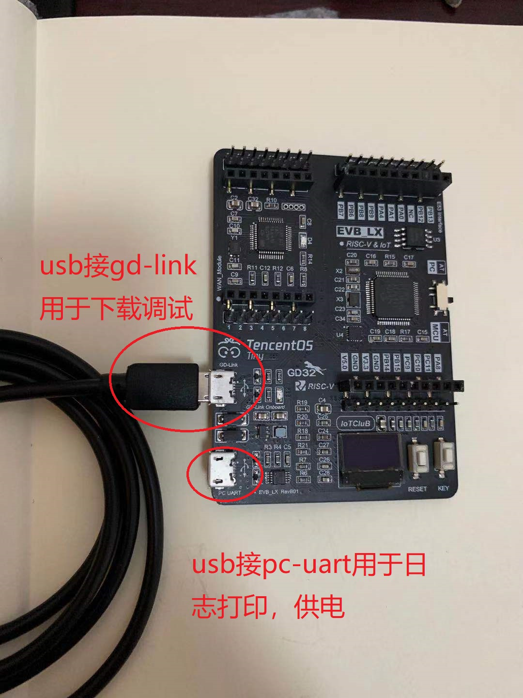

## 2. 定制开发板EVB_LX软件开发环境准备

### 2.1 Nuclei Studio IDE下载
目前GD32V成熟的集成开发环境是由芯来科技提供的Nuclei Studio IDE，TencentOS tiny中的RISC-V项目也是基于Nuclei Studio IDE。首先我们下载Nuclei Studio IDE软件开发包，下载链接为https://www.nucleisys.com/download.php  如下图所示。

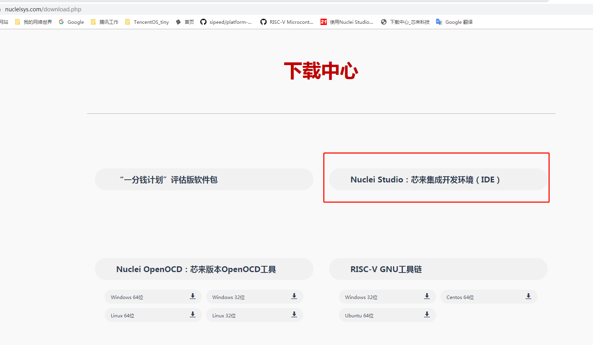

单击“Nuclei Studio：芯来集成开发环境（Nuclei Studio IDE）”即可进入下载页面。
### 2.2  Nuclei Studio IDE安装
下载下来的芯来集成开发环境（IDE）Nuclei Studio压缩包解压后包含若干个文件。
Nuclei Studio软件包：该软件包中包含了Nuclei Studio IDE的软件。注意：具体版本以及文件名可能会不断更新；
HBird_Driver.exe：此文件为芯来蜂鸟调试器的USB驱动安装文件，调试时需要安装此驱动使得其USB能够被识别；
JDK安装文件：jdk-8u512-windows-x64.exe；

* 1.Nuclei Studio IDE是基于eclipse的，eclipse需要jdk环境支持，你的电脑如果没有安装jdk环境需要先安装jdk-8u512-windows-x64.exe，直接双击安装即可，如果已经安装可以跳过；
* 2.安装HBird_Driver.exe
* 3.Nuclei Studio软件本身为绿色软件无需安装，安装好JDK运行环境后，直接单击Nuclei Studio文件夹中eclipsec.exe即可启动Nuclei Studio。

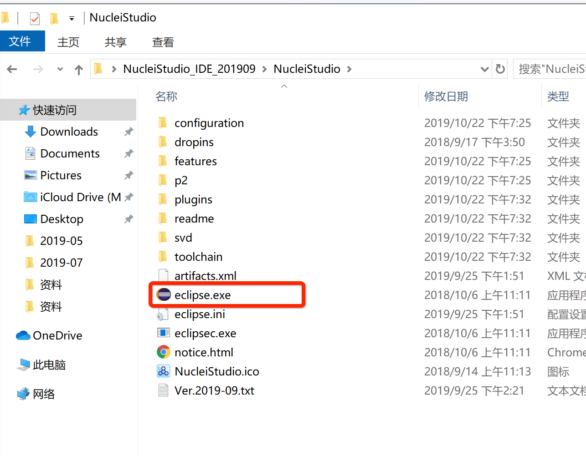

直接单击NucleiStudio_IDE文件包中NucleiStudio文件夹下面的eclipse.exe可执行文件，即可启动Nuclei Studio；
第一次启动Nuclei Studio后，将会弹出对话框要求设置Workspace目录，该目录将用于放置后续创建项目的文件夹，如图所示；

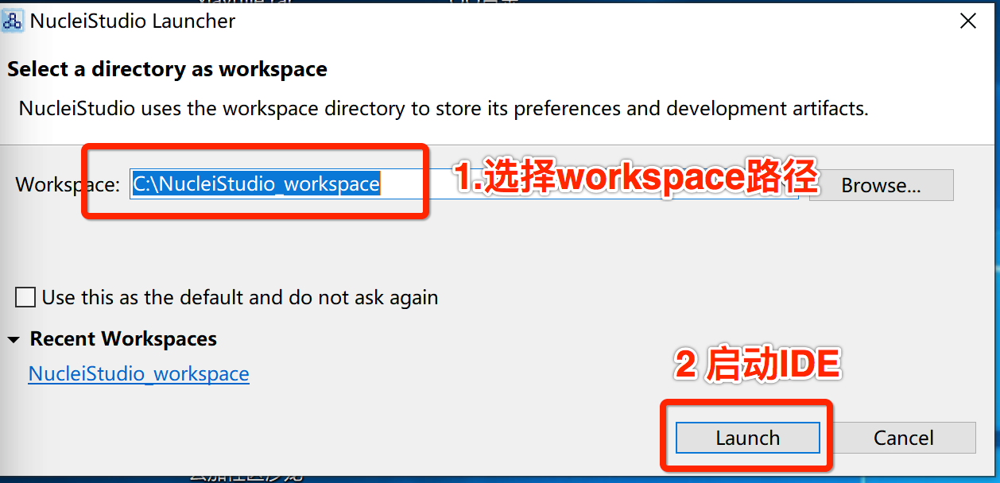

设置好Workspace目录之后，确保Workspace的路径中没有中文，单击“Launch”按钮，将会启动Nuclei Studio。第一次启动后的Nuclei Studio界面如图所示。

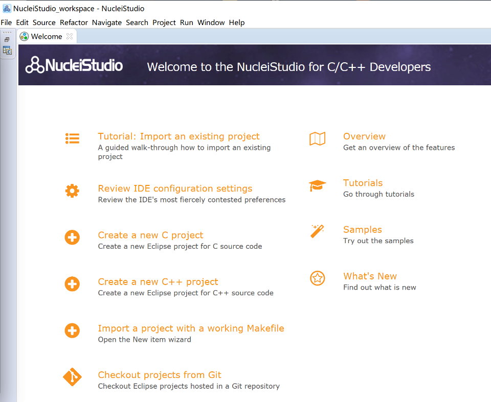

### 2.3 导入基于TencentOS tiny的RISC-V工程
先下载TencentOS tiny项目，下载地址为：
https://github.com/Tencent/TencentOS-tiny 
官方地址直接下载zip包或者直接使用下面的命令clone下来：

git clone  https://github.com/Tencent/TencentOS-tiny.git

在菜单栏选择”File->Import“，出现如图对话框，选择”General“菜单下”Exit Project into Workspace“，设置导入方式，然后点击按钮”Next“。

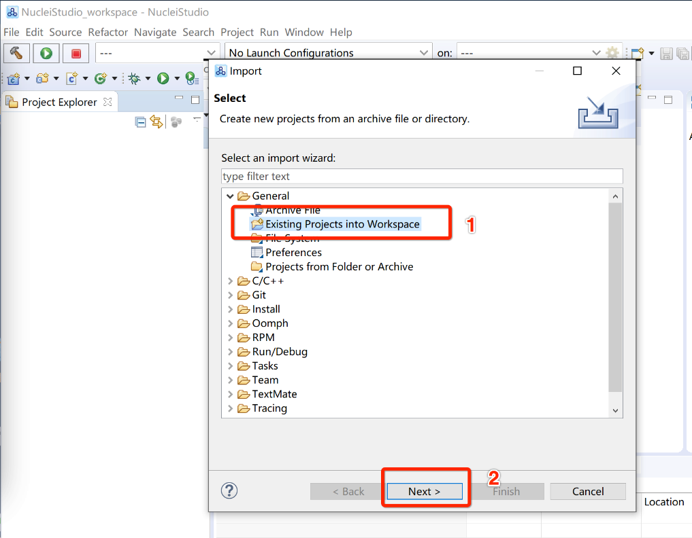

选择导入的方式后，点击” Browse“按钮选择TencentOS tiny项目中GD32V工程路径。注意：进入到” TencentOS-tiny\board\TencentOS_tiny_EVB_LX\eclipse"这一级目录即可，如图所示。

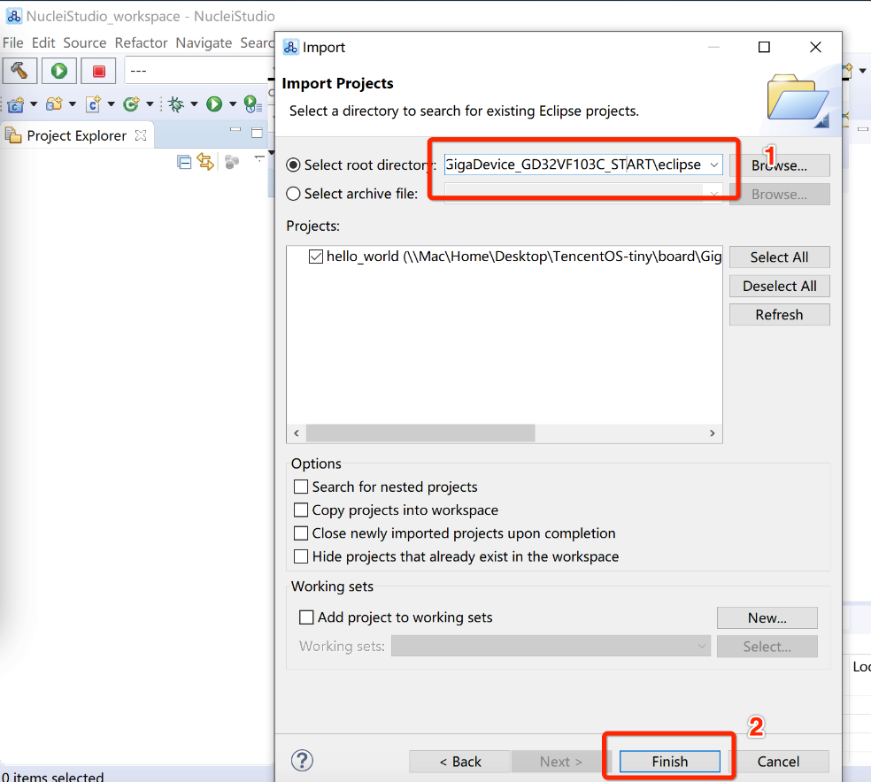

### 2.4 编译下载调试基于TencentOS tiny的RISC-V工程

导入之后，就可看到TencentOS tiny的hello_world工程了，如图所示：
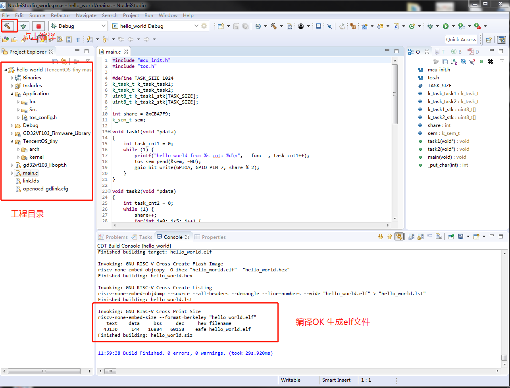

Hello_world工程文件夹上右键 Debug As，选择Debug Configuration，配置调试参数，如下图所示：

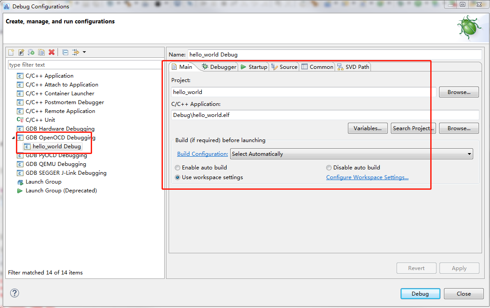

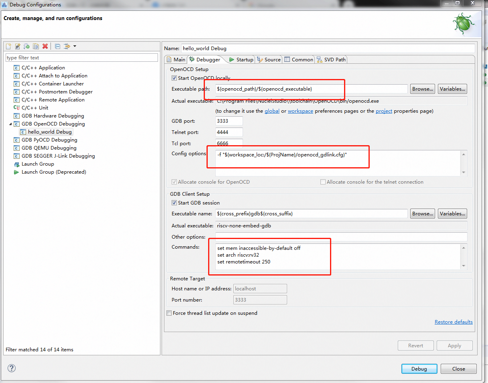

然后点击Debug即可进入调试窗口，如下图所示，可以进行单步、跳步执行，设置断点等

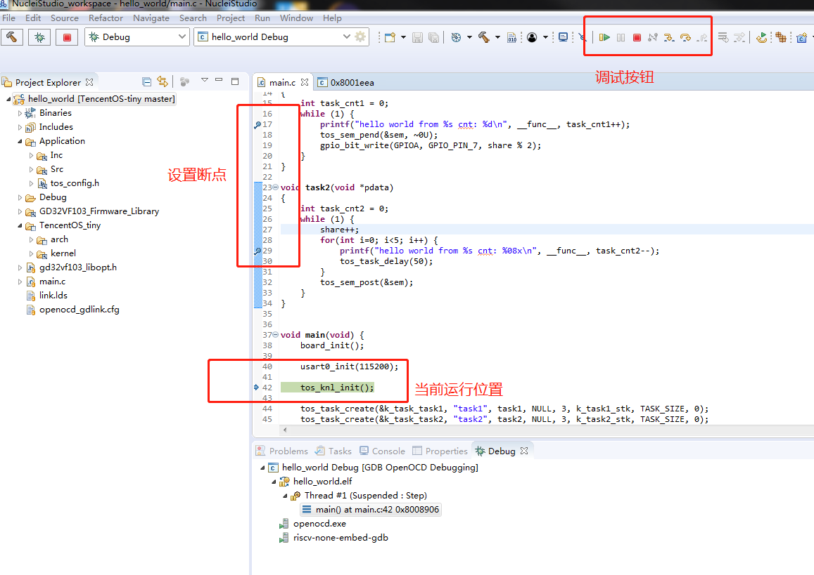