# 1. TencentOS-tiny OTA

## 1.1. OTA与IAP

IAP全称 In Application Programming，什么是在应用编程呢？

正常开发流程如下：

- 使用Keil MDK工具编写应用程序；
- 编译出.axf可执行程序或者.bin文件，或者.hex文件；
- 使用Keil MDK工具直接烧录.axf文件到STM32 Flash中，或者使用类似STM32CubeProg之类的软件烧录.bin文件到STM32 Flash中；
- 复位，单片机从Flash起始地址处读取程序并执行；

当产品开发完成用于生产后，通常不会再引出下载器接口给用户，所以也就无法连接各种各样的下载器，更别说用Keil或者STM32CubeProg这些工具下载程序，如果发现应用程序有漏洞，或者要修改部分功能，都已经无法完成。

### 1.1.1. IAP设计思想

IAP巧妙的解决了这个问题，即在应用程序正常工作的时候，还可以接收新的固件并烧录到Flash中。

- 应用程序如何接收新的固件？

一般产品设计时都会留一个用于打印日志信息的串口，可以直接利用此串口来接收PC发送到新固件，传输协议大多都采用Y-Modem协议。

- 接收之后的新固件存放到哪里？

固件大小一般都有几十KB或者上百KB，应用程序接收到新的固件之后，如果是以数组的形式暂存在RAM空间中，不仅会浪费RAM空间，而且容易发生固件数据丢失，所以直接存储到空闲的Flash空间中是最好的方式。

eg. 官方开发板使用的芯片是STM32L431RCT6，Flash空间有256KB，如果应用程序的大小只有100KB，那么接收进来的新固件就可以存放在剩余的156KB空间中。

同时会人为的对Flash划分分区，也就是对某一段地址空间起个名字，如下图：


- 如何将老固件替换为为新固件？

上电之后CPU会从Flash的起始地址处读取数据开始执行，这点无法改变，正在运行的应用程序如果进行自己擦除自己的操作，设备直接变砖。

bootloader可以完美的解决这一问题，即写一小段应用程序，放在Flash的起始位置处，使得每次上电之后最先运行bootloader，完成两个功能：

- 检查升级标志，是否有新的固件被下载到IAP分区中；
- 如果无升级标志，则跳转到ActiveAPP分区，开始执行应用程序；
- 如果有升级标志，则先将IAP分区中的固件拷贝到ActiveAPP分区中，然后跳转到ActiveAPP分区，开始执行新的应用程序；

加入bootloader之后，整个Flash的分区情况如下：

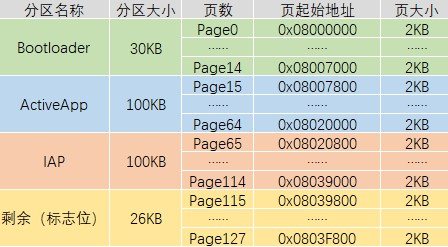

### 1.1.2. OTA设计思想

在IAP的这种设计思想之上，因为当前的物联网设备都已经具备基本的网络通信功能，所以无需通过串口传输新的固件，直接通过网络传输新的固件即可，称之为OTA IAP(Over The Air In Application Programming)，也就是平常所说的空中升级，简称OTA。

## 1.2. OTA组件概述、特性及优势

TencentOS-tiny中提供的OTA组件完全开源免费，相较于其他的OTA功能，TencentOS-tiny OTA组件提供更小的差分升级包，耗用更少的传输流量，占用更小的内存空间，提供更可靠的升级服务。

TencentOS-tiny OTA组件有以下的特性：

- 传输差分升级包，而不是整个固件
- 灵活的分区表功能
- 支持原地升级
- 支持乒乓升级，可以在升级中断的情况下进行版本回滚
- 支持通过HTTP从自建服务器拉取固件
- 支持从腾讯云平台进行统一的固件拉取和管理

## 1.3. OTA组件开发调试推荐流程

OTA的整个流程调试较复杂，如果分步来做会比较容易：

(1)调试bootloader是否可以正常读取分区表信息；

(2)调试bootloader是否可以正常跳转到Active APP;

(3)调试bootloader是否直接可以根据patch包进行升级;

(4)调试Active APP是否可以通过网络拉取patch升级包并下载到 OTA 分区;

(5)综合调试。

# 2. 分区规划及分区表的生成、烧录

## 2.1. 分区规划

TencentOS-tiny支持两种升级方式，两种升级方式对应有不同的分区表

原地升级方式中，bootloader直接根据旧固件+patch升级包生成新的固件，一旦开始升级，无论升级成功与否都无法回滚到上一个版本，主要有五个分区：

- Bootloader分区
- Active APP分区：当前正在运行的固件存放分区；
- OTA分区：新固件存放分区；
- KV分区：记录系统升级中的一些环境变量；
- 分区表：存放分区表（固定大小32B，一般放在Flash的最后一个扇区中）

乒乓升级方式中，bootloader在升级之前会将原来的固件拷贝一份，一旦开始升级，无论新固件升级成功与否，都可以回滚到上一个版本，主要有六个分区：

- Bootloader分区
- Active APP分区：当前正在运行的固件存放分区；
- **Backup分区**：备份当前正在运行的固件；
- OTA分区：新固件存放分区；
- KV分区：记录系统升级中的一些环境变量；
- 分区表：存放分区表（固定大小32B，一般放在Flash的最后一个扇区中）

在实际应用中，两种方式的选择要根据设备需求，设备Flash空间大小，设备Flash扇区大小综合考虑。

本文接下来如无特殊说明，都是以第一种方式（原地升级）为例，官方板的Flash大小为256KB，可以如下分区：

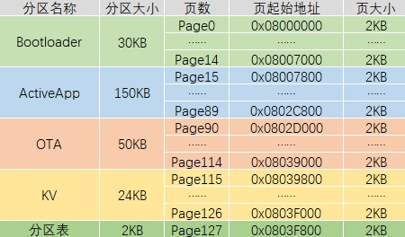

## 2.2. 分区表工具的使用方法

TencentOS-tiny 源码中提供了一个生成分区表的命令行工具，需要先使用gcc编译，没有gcc环境可以安装MinGW。

### 2.2.1. 编译

进入`\components\ota\tools\partition_table`目录，执行make命令开始编译，编译之后进入到当前目录下的`out\target`即可看到工具 `ptbl.exe`：
```bash
cd out/target/ 
```
该工具有如下参数：

- `-h`：打印帮助信息
- `-p <ip/pp>`：选择升级方式,ip或者pp
- `-a <start,end>`：Active APP分区的起始和结束地址
- `[-b <start,end>]`：Backup 分区的起始和结束地址，选了pp方式才需要
- `-o <start,end>`：OTA分区的起始和结束地址
- `-k <start,end>`：KV分区的起始和结束地址
- `-v <major>.<minor>`：初识固件版本号

为官方板生成分区表文件的命令如下：
```bash
./ptbl.exe -p ip -a 0x08007800,0x0802D000 -o 0x0802D000,0x08039800 -k 0x08039800,0x0803F800 -v 0.1 ptbl.bin
```
运行之后即可在当前目录下看到生成的分区表文件`ptbl.bin`。

## 2.3. 分区表烧录方法

生成的分区表文件`ptbl.bin`可以通过STM32CubeProg直接烧录到Flash中，按照之前规划的分区，烧录位置为 0x0803F800 ，烧录方法如下：

(1)使用下载器连接开发板到PC，打开STM32CubeProg工具，点击Connect连接到开发板：

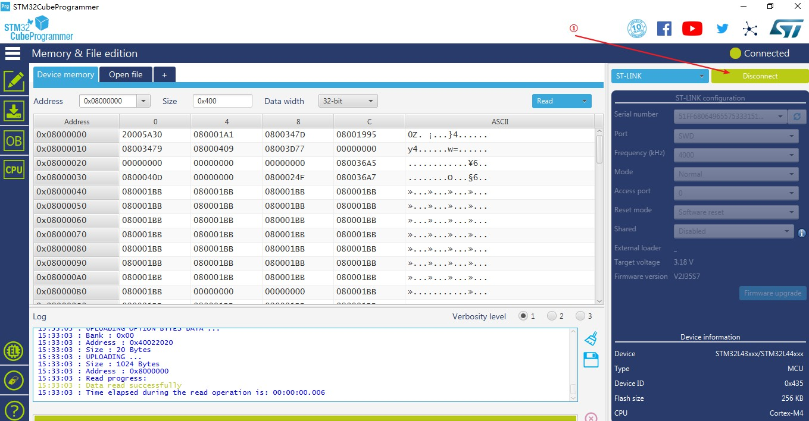

(2)如果是**第一次使用OTA**，点击左侧的烧录按钮，点击全片擦除：

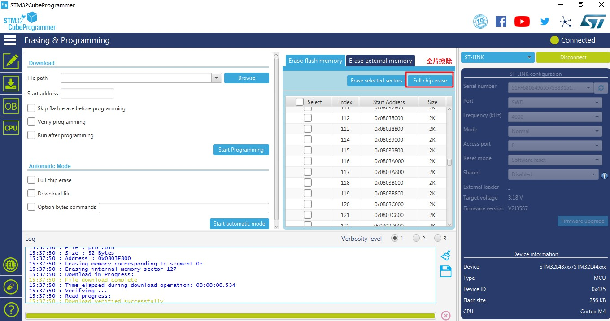

>第一次使用的时候，KV分区中的数据不确定，可靠起见直接选择全片擦除。

(3)点击左侧的烧录按钮，选择刚刚生成的`ptbl.bin`，下载地址填写 0x0803F800，点击烧录：


出现烧录成功弹窗即可。

# 3. 测试Bootloader程序

进入`board\TencentOS_tiny_EVB_MX_Plus\KEIL\ota`目录，打开官方提供的bootloader示例工程：`ota_bootloader_recovery`。

bootloader其实是一个裸机程序，在 main 函数中主要有三部分，分别对应三个功能：

- 读取分区表
- 根据patch包进行升级
- 跳转到Active APP分区开始执行

接下来将完成 1.3 节所给出的OTA组件开发调试推荐流程前三步。

## 3.1. 测试bootloader是否可以读取分区表

首先需要指定分区表地址：
```c
uint32_t partition_addr = 0x0803f800;
```

完善初始化环境变量的代码，在初始化之后手动添加打印分区表的代码，最后的while(1)用于停止程序，防止进行后面的功能：
```c
    if ((ret = ota_env_init(OTA_UPDATE_IN_POSITION, partition_addr, &stm32l4_norflash_onchip_drv_ota, &stm32l4_norflash_onchip_prop_ota)) != OTA_ERR_NONE) {
        printf("env init failed!OTA errcode = %d\n", ret);
        return -1;
    } else {
		printf("env init successfully!\r\n");
		printf("+-------------------------+\r\n");
		printf("|Active APP |  0x%08x |\r\n", ota_partition_start(OTA_PARTITION_ACTIVE_APP));
		printf("|   OTA     |  0x%08x |\r\n", ota_partition_start(OTA_PARTITION_OTA));
		printf("|   KV      |  0x%08x |\r\n", ota_partition_start(OTA_PARTITION_KV));
		printf("| Version   |      %d.%d    |\r\n", ota_partition_init_version_get().major, ota_partition_init_version_get().minor);
		printf("+-------------------------+");
	}
		
	while(1);
```
修改程序编译地址和大小，与Bootloader分区的划分相对应：

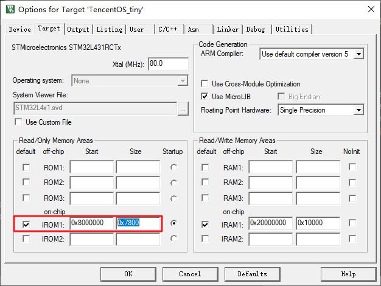

编译程序。

编译成功之后修改下载设置，选择扇区擦除方式、设置程序烧录起始地址、设置程序烧录大小，同样与bootloader分区的划分相对应：

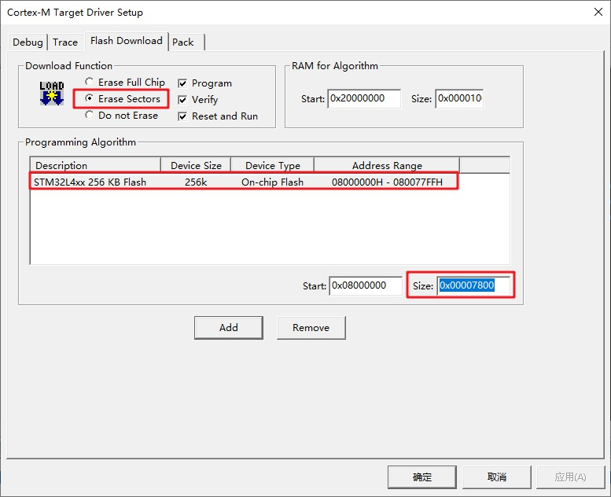

下载程序，在串口助手中观察输出：

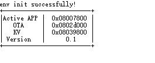

## 3.2. 测试bootloader是否可以跳转到Active APP分区

打开和bootloader在一个目录下的app工程：`ota_application_download_through_http`。

目前我们只是测试bootloader是否可以跳转过来执行此程序，所以如图所示修改代码，不要触发OTA固件拉取功能：

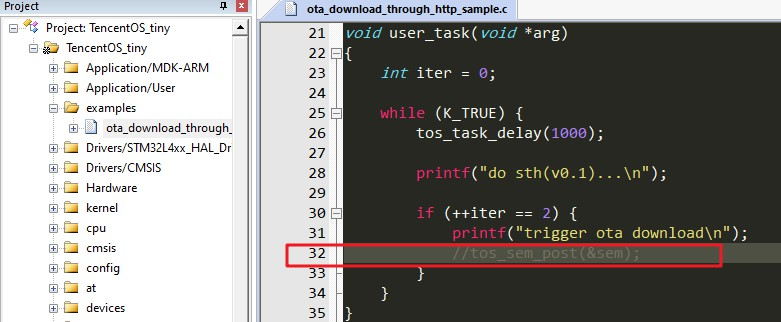

另外，因为此程序被烧录到 Active APP 分区，是从Active APP分区的起始地址开始运行的，所以需要修改中断向量表的偏移地址，如图：


同样修改程序编译的起始地址和大小，与规划的 Active APP分区信息相对应：

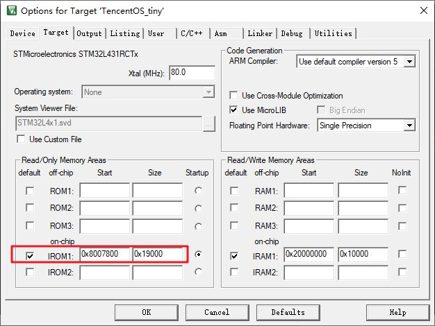

编译程序。

编译成功之后修改下载设置，烧录到Actice APP分区中：

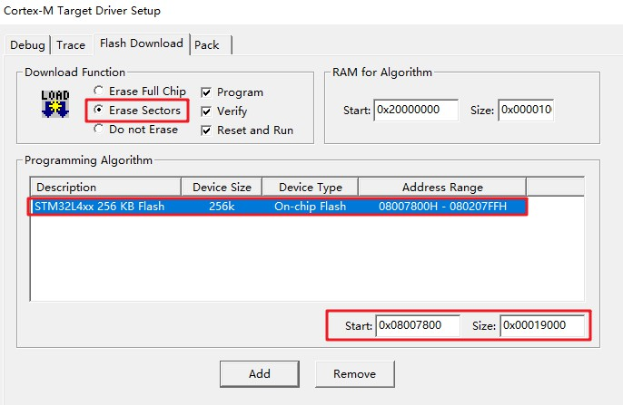

最后再修改bootloader程序，屏蔽while(1)，屏蔽OTA固件升级功能，开启跳转功能：

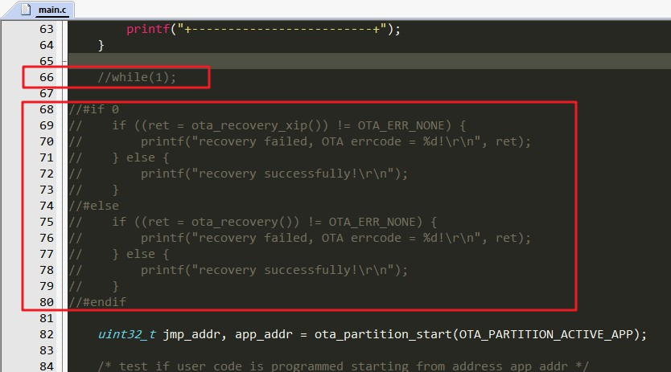

再次编译，下载bootloader，复位开发板，查看串口助手中的输出，可以看到bootloader成功跳转到Actice APP开始执行：

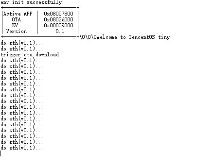

## 3.3. 差分patch包生成方法

### 3.3.1. 准备老固件和新固件

官方示例工程已经在MDK中配置编译后生成.bin固件，如图：

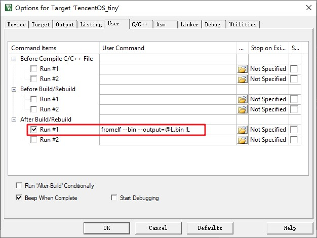

编译之后会在工程目录下生成TencentOS_tiny.bin文件，拷贝一份出来，重命名为:TencentOS_tiny_0_1.bin，表示这是0.1版本的固件。

修改app工程，将打印信息中的0.1改为0.2，以验证是否升级成功：

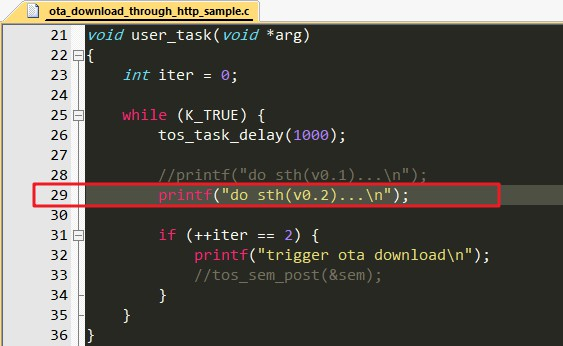

重新编译，生成新固件TencentOS_tiny.bin，同样拷贝一份，重命名为：TencentOS_tiny_0_2，表示这是0.2版本的固件。

### 3.3.2. 差分升级包生成工具的使用

>编译此工具同样需要gcc环境。

进入`\components\ota\tools\diff`目录，执行make命令开始编译，编译之后进入到当前目录下的`out\target`即可看到工具 `diff.exe`：
```bash
cd out/target/ 
```
该工具有如下参数：

- `-h`：打印帮助信息
- `-v`：打印更多信息
- `-s`：<待定...>
- `-b <n>`：指定扇区大小，单位：字节Byte
- `-n <major>.<minor>`：新的固件版本号
- `-o <major>.<minor>`：旧的固件版本号

将3.3.1节准备的两个固件拷贝到当前工具所在目录下。

根据前面准备的两个新旧固件，制作差分升级包的命令如下：
```bash
./diff.exe -v -b 2048 -n 0.2 -o 0.1 TencentOS_tiny_0_1.bin TencentOS_tiny_0_2.bin patch.bin
```
运行之后即可在当前目录下看到生成的差分升级包`patch.bin`。

## 3.4. 测试bootloader是否可以根据patch进行升级

使用STM32CubeProg直接将差分升级包patch.bin下载到OTA分区：

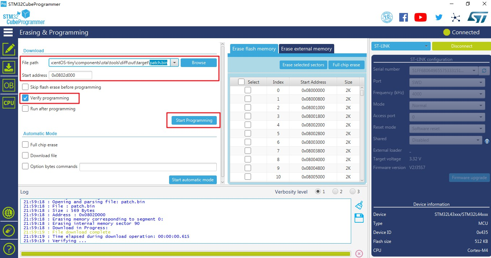

下载成功后，因为bootloader通过检测KV分区中的环境变量new_version来判断是否有新的固件，但是环境变量在app程序拉取固件成功之后才会设置，所以我们手动在bootloader中来设置此环境变量。

在main.c中引入KV的头文件：
```c
#include "tos_kv.h" 
```

在环境变量初始化代码之后，升级代码之前添加如下的代码：
```c
ota_img_vs_t new_version;
new_version.major = 0;
new_version.minor = 2;

tos_kv_set("new_version", &new_version, sizeof(ota_img_vs_t));
```

添加之后编译，下载，在串口助手中查看输出：

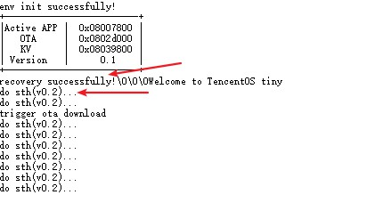

可以看到bootloader成功根据patch差分包和旧的固件，还原出了新的固件并成功升级。

# 4. 使用HTTP方式获取固件并升级

TencentOS-tiny OTA组件支持使用 HTTP 协议拉取差分升级patch包，并烧写到OTA分区中。

## 4.1. 准备HTTP服务器

HTTP服务器的选择非常多，常用选择有：

- 在Windows上使用类似MyWebServer的小工具开启HTTP服务
  - 优点：简单方便，用于测试
  - 缺点：无公网ip，只能在同一个局域网内被访问

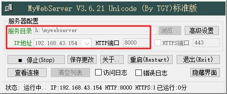

- 在云服务器上安装类似Nginx的工具，开启HTTP访问
  - 优点：性能强劲、有公网ip、支持高并发（大量设备同时开机拉取固件）
  - 缺点：安装过程较复杂


除了这两种方式外，还有很多的方式可供选择，只需要开启HTTP服务即可，本文中我使用第一种方式。

开启之后将第3步中生成的差分升级固件 patch.bin 上传/复制到HTTP服务目录中，然后使用浏览器访问`http://<已经开启HTTP服务PC的ip>:<HTTP服务端口>/patch.bin`，测试正常获取之后方可进行后续操作。

>开启HTTP服务之后记得关闭各种防火墙，比如Win10网络防火墙，云服务器安全组等。

## 4.2. HTTP获取固件并升级

(1)使用STM32CubeMX Prog全片擦除，烧写分区表到0x0803f800;

(2)修改bootloader程序，去除手动设置new_version环境变量代码，编译，下载，**不要复位**:


(3)修改Actice APP工程(`ota_application_download_through_http`)，开启HTTP固件拉取和升级功能:

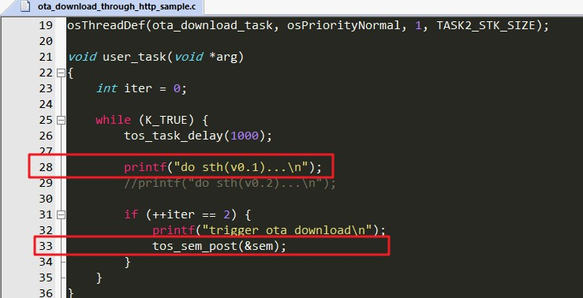

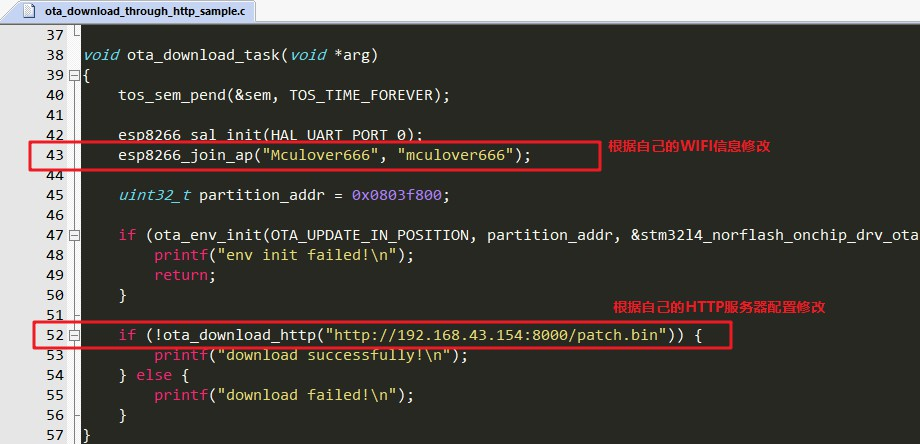

修改之后编译，下载。

特别注意，**此时0.1版本的程序已经被我们修改，所以之前生成的patch包无法完成升级**，重新在0.1版本的基础上修改处0.2版本的程序，并制作patch包。

重复一遍之前的制作流程即可：

- ① 将当前固件拷贝出来，重命名为`TencentOS_tiny_0_1.bin`;
- ② 修改打印提示，表示这是0.2版本的程序：

```c
printf("do sth(v0.2)...\n");
```

- ③ 将新固件拷贝出来命名为`TencentOS_tiny_0_2.bin`;
- ④ 使用diff命令行工具或者可视化工具制作差分升级包patch.bin；
- ⑤ 将制作出的差分升级包拷贝/上传到HTTP服务器目录；

此时，一切准备就绪，复位设备，即可在串口助手中看到OTA的升级状况：

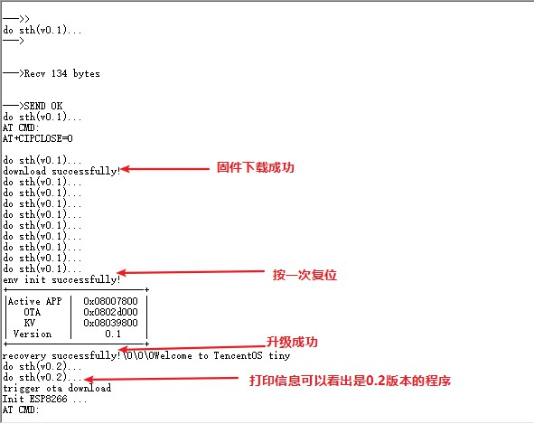
